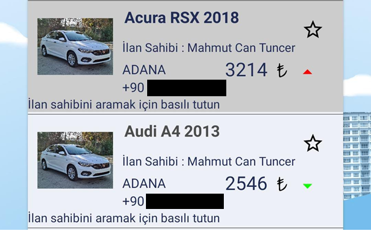

# KrankRent App
This is Sample Rent a Car App 

I wrote this app on Java

Anyone can share own car. When anyone like a car press and hold on the car ad. And application redirect phone screen. 

I used some Design Pattern in the app

Which are :

#### State Design Pattern

```
    If car is busy then background color is gray and disabled
    No one can press and hold the advertisement
```

### Proxy Design Pattern


```
    If Advertisement increases Data is going to icreases. Data should not come all at once.
    App works slowlier, but anyone accept that.
```


```
    When someone follows a car and car rent cost is chiper this app send a notification to follower.
```

```
    This is the special page for admin. Admin can see how many advertisement on the application, can see busy cars and see how many users use the application
```